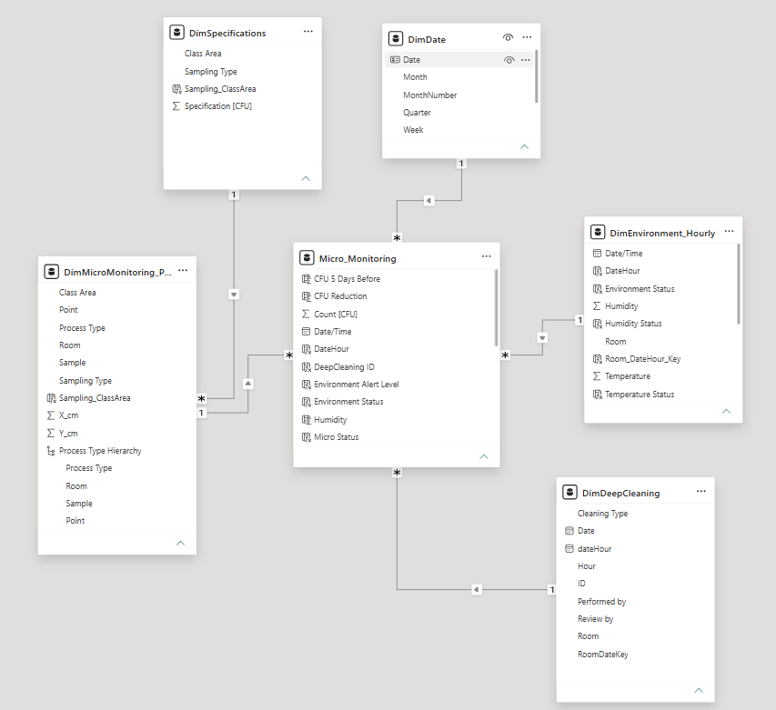

# Environmental Monitoring Dashboard for a Pharmaceutical Plant

## 1. Dashboard Purpose — Business Problem

Environmental monitoring in pharmaceutical facilities generates large volumes of microbiological and environmental data that must be continuously reviewed to ensure cleanroom conditions remain under control.

This project originated from an Excel heatmap I previously built using the Maps feature to visualize microbiological monitoring points across a pharmaceutical plant layout. Although the solution was useful for spatial analysis, performance became a limitation as the number of records increased.

The solution was therefore rebuilt in **Power BI** to create a more scalable and interactive monitoring system.


The dashboard integrates:

* Microbiological counts
* Temperature and relative humidity
* Cleanroom classification
* Sampling type
* Process area
* Monitoring point
* Time trends

Its purpose is to help identify critical monitoring points, detect deviations, evaluate environmental stability, and support investigations in a GMP-oriented environment.

---

## 2. What the Model Does

The model connects microbiological monitoring results with environmental and contextual information.

It allows users to:

* Compare microbiological results against specifications.
* Identify monitoring points with higher CFU counts.
* Analyze microbiological compliance by cleanroom class and sampling type.
* Track temperature and humidity trends over time.
* Evaluate possible relationships between environmental conditions (temperature and humidity) and microbiological behavior.
* Visualize monitoring points directly on the pharmaceutical plant layout using X/Y coordinates.

### Deep Cleaning Effectiveness

A dedicated report page evaluates whether **Deep Cleaning activities** effectively reduce microbiological risk.

The analysis includes:

* Overall effectiveness KPI vs target.
* Effectiveness by cleanroom classification.
* Effectiveness by sampling type.
* Detailed monitoring-point analysis.
* Identification of recurring issues after cleaning.

This helps determine whether cleaning procedures are effective or whether additional investigation or process improvement may be required.

---

## 3. Solution Architecture

The solution follows a **star-schema-inspired analytical model**.

### Main Tables

* **`Micro_Monitoring`**
  Contains microbiological monitoring results, dates, rooms, CFU counts, and Deep Cleaning identifiers.

* **`Environment_Hourly`**
  Contains temperature and relative humidity measurements by room and hour.

* **`MicroMonitoring_Points`**
  Contains monitoring-point attributes such as room, cleanroom class, sampling type, process area, and X/Y coordinates.

* **`Specifications`**
  Contains microbiological acceptance limits by cleanroom classification and sampling type.

* **`DimDate`**
  Supports time-based analysis such as monthly and yearly trends.

### Analytical Flow

```text
Monitoring Points
      |
      v
Microbiological Monitoring
      |
      +-------------------+
      |                   |
      v                   v
Specifications      Environmental Data
      |                   |
      +---------+---------+
                |
                v
        Compliance Analysis
                |
        +-------+-------+
        |               |
        v               v
 Spatial Analysis   Trend Analysis
```

Deep Cleaning analysis extends this logic by comparing microbiological results before and after cleaning events.

---

## Business Value

The dashboard transforms isolated monitoring records into a connected environmental monitoring solution.

It supports:

* Detection of microbiological trends.
* Identification of critical monitoring areas.
* Environmental excursion analysis.
* Cleanroom performance evaluation.
* Assessment of corrective action effectiveness.
* Data-driven continuous improvement.

The solution helps to identify Where is the risk occurring, under which conditions, and if the corrective actions reducing that risk.

## Model

